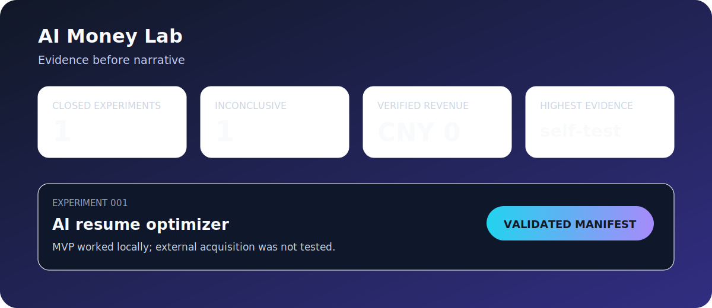

<div align="center">

# AI Money Lab

### An evidence ledger for small AI business experiments

Build a tiny offer, define the channel and stop rule, publish the result, and keep the evidence level machine-checkable. Failed and inconclusive experiments stay visible.

[](https://github.com/shkyyy18/ai-money-lab/actions/workflows/ci.yml)
[](https://github.com/shkyyy18/ai-money-lab/releases/latest)
[](experiments/)
[](leaderboard.md)
[](LICENSE)

[**Experiment ledger**](leaderboard.md) | [Methodology](methodology.md) | [Nominate an experiment](https://github.com/shkyyy18/ai-money-lab/issues/new?template=nominate.yml) | [Contributing](CONTRIBUTING.md)

**Machine-readable status | Explicit stop rules | Evidence tiers | No fake success stories**

</div>



## Current ledger

| Experiment | Status | Revenue | Evidence | What the record proves |
|---|---|---:|---|---|
| [001 - AI resume optimizer](experiments/001-ai-resume-optimizer/result.md) | Inconclusive, stopped | CNY 0 | Self-test only | The MVP ran locally; the acquisition hypothesis was not tested with external traffic. |

Current machine-validated totals:

- 1 closed experiment;
- 0 succeeded;
- 0 verified failures;
- 1 inconclusive;
- CNY 0 verified revenue.

## Why this project exists

Public build logs often blur three different things: a product that runs, a landing page that receives visits, and a business that receives payment. AI Money Lab keeps them separate.

A local self-test can prove that an MVP executes. It cannot prove demand, willingness to pay, acquisition efficiency, or revenue. When evidence is missing, the correct result is **inconclusive**, not a dramatic success or failure claim.

## Evidence ladder

Every `experiment.json` declares one evidence level:

| Level | Meaning |
|---|---|
| `none` | No execution evidence has been recorded. |
| `self-test` | The author tested the product locally. |
| `public-metrics` | Public or redacted acquisition/conversion metrics are attached to the report. |
| `verified-revenue` | Revenue evidence is attached in a privacy-safe, independently reviewable form. |

The repository never upgrades evidence based on narrative confidence alone.

## Audit the ledger locally

The validator uses only the Python standard library.

```bash
git clone https://github.com/shkyyy18/ai-money-lab.git
cd ai-money-lab
python lab.py validate
python lab.py summary
python -m unittest discover -s tests -v
```

CI checks required fields, unique IDs, dates, statuses, non-negative revenue, evidence levels, and report links.

## Experiment lifecycle

1. Write the customer, problem, offer, price, acquisition channel, metric, and stop rule.
2. Set the initial evidence level to `none`.
3. Build the smallest test that can exercise the hypothesis.
4. Record only observed traffic, conversion, cost, and revenue.
5. Stop on the predeclared rule or explain the deviation.
6. Publish the manifest and human-readable report, including missing evidence.

See [methodology.md](methodology.md) for the complete rules.

## What belongs here

Good experiments have a narrow question and an evidence plan. Examples:

- Will a specific customer segment click or request a demo from one concrete offer?
- Can a productized AI workflow save a measurable amount of time for a defined role?
- Will users pay a stated price through a stated channel?

This is not a repository for generic AI business ideas, fabricated screenshots, copied revenue claims, or unbounded "build and hope" projects.

## Contribute

You can:

- nominate a bounded experiment through the issue template;
- improve the validator and evidence schema;
- review a result for contradictions or unsupported claims;
- contribute a privacy-safe evidence pattern.

Read [CONTRIBUTING.md](CONTRIBUTING.md). Do not submit private customer data, credentials, fabricated metrics, or AI-generated proof.

## Repository map

```text
experiments/<id>-<slug>/
  experiment.json   machine-readable status and evidence
  result.md          human-readable outcome and limitations
lab.py               offline validator and summary command
methodology.md       evidence and classification rules
leaderboard.md       generated-from-records public ledger view
```

## Project status

Version 0.1 establishes the evidence contract and records one inconclusive experiment. Experiment 002 will not be opened until its customer, channel, stop rule, and evidence plan are explicit.

## License

MIT. Experiment reports are educational records, not financial or business guarantees.
